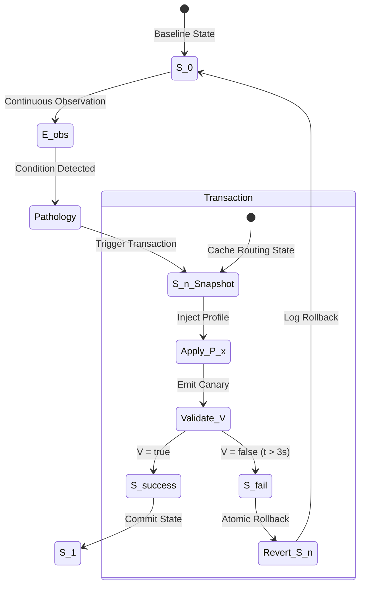

# State Machine Architecture

**Definition:** The system architecture is a bifurcated set $\{A, C\}$ where $A$ is the deterministic execution path and $C$ is the non-deterministic analytic path.

## Set A: Runtime ($E$)
**Condition (Necessary):** $E$ must compile natively for the router target ($MT7981B$).
**Condition (Sufficient):** $E$ is written in Rust, statically compiled with `opt-level=z`, achieving binary size $S_b < 3\text{MB}$.

**Sub-components of $E$:**
- $E_{check}$: Executes continuous Boolean validation $V(path) \in \{\text{true}, \text{false}\}$.
- $E_{obs}$: Maps negative validation events to a local finite state vector (SQLite).
- $E_{prof}$: Injects static routing rules to state table.
- $E_{roll}$: Deterministic function enforcing Axiom 1 ($S_{n+1} \to S_n$).

## Set C: Analytics ($W$)
**Condition (Necessary):** $W$ operates strictly external to the router bounds.
**Condition (Sufficient):** $W$ executes on a Debian/RHEL Virtual Machine.

**Sub-components of $W$:**
- $W_{pcap}$: Parses raw packet streams transferred from $E_{obs}$.
- $W_{LLM}$: Non-deterministic function $L(telemetry) \to P_{index}$, where $P_{index}$ is a recommendation vector for $E_{prof}$.

## Mutation Transaction Diagram

