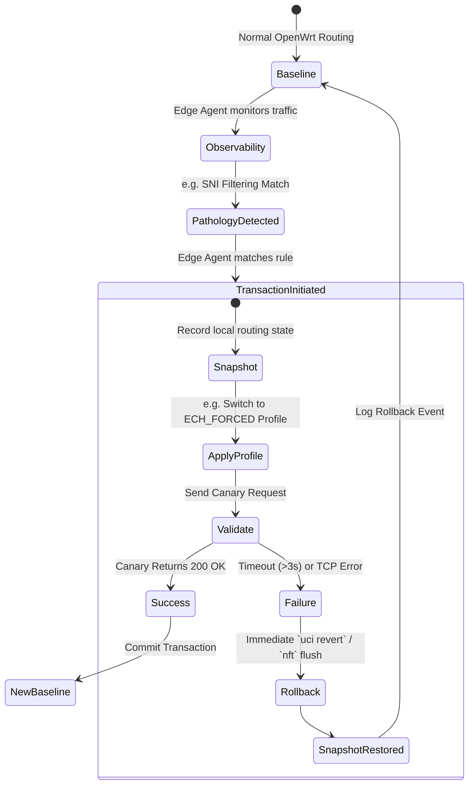

# A/C Architecture & Transaction Flow

This document details the corrected architecture for the Blueshoes prototype, optimized for the GL.iNet GL-MT3000 OpenWrt router constraints (15MB RAM budget).

## Architecture Split

The system uses a strict separation between the execution path (A) and the advanced diagnostic path (C).

### A. `bs-edge-agent` (The Router Runtime)
Written in **Rust** (optimized for size) to run natively on OpenWrt without heavy containerization (LXC/Docker are banned from Phase 1 due to 256MB flash limits).
- **Core Components**:
  - `netcheck`: Lightweight, continuous connection validation (ping, curl).
  - `observability`: Captures TCP RSTs, DNS failures, logs to a 2MB SQLite DB.
  - `profile-engine`: Applies strictly bounded, static routing rules via `nftables` / `uci`.
  - `rollback-journal`: Ensures any applied profile that fails validation is reverted in < 5 seconds.

### C. `bs-workbench` (The Diagnostic Brain)
An external Debian/RHEL VM or laptop companion.
- **Core Components**:
  - `deep-analysis`: Runs `tshark`/`wireshark` on PCAPs pulled from the router.
  - `llm-brain`: Ingests telemetry to classify novel georestriction strategies and generate profile recommendations (Read-Only).

*(Note: The B layer, `bs-sandbox`, an LXC container on the router, is deferred as MT-3000 storage is too constrained).*

## The Mutation Transaction Flow

